## Automating Data Lake Using LakeFormation and Visualize using Quicksight
**Background**
Most of the enterprises have data on the traditional on premise systems. This could be CRM, ERP, Database systems etc. A data lake is a centralized repository that allows you to store all your structured and unstructured data at any scale. AWS provides the most comprehensive, secure, and cost-effective portfolio of services that enable customers to easily build their data lake in the cloud and analyze all their data with the broadest set of analytical approaches, including machine learning. S3, functions as the Datalake due to its Durability, availability, high performance, easy to use, scalability. 
Introduction
This guide allows to build a data lake and automation data ingestion from database layer into s3. Lakeformation is used to automate the data ingestion. Once the data is ingested into s3, it can be analyzed using Athena and further visualized using Quick sight.

**Architecture**
 
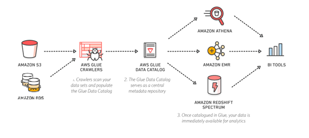
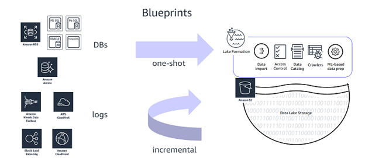

From the above diagram, the glue crawler and jobs are autmated using Lakeformation and data is ungested to s3. And then it can be further anakyzed using Athena andVisuaized using Quicksight.
 
**Steps to Execute**

Create a RDS database and Load some sample data.
Check for connectivity for RDS
Create a JDBC connection to RDS in AWS Glue
Lake Formation IAM Role
NOTE: If your account is already setup with Glue Data catalog permissions then upgrade to Lake Formation Permission set by following -Link
Lake Formation – Add Administrator and start workflows using Blueprints 
Explore the components of a Glue WorkFlow created by lake formation
Explore workflow results in Athena
Grant fine grain access controls to Data Lake user
Verify data permissions using Athena

Create a RDS database and Load some sample data

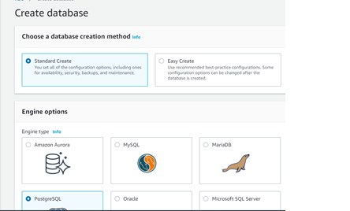

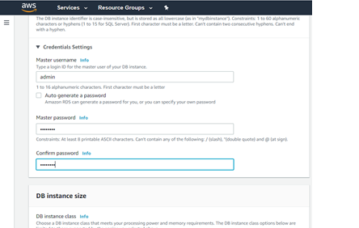

Navigate to the AWS Glue service.
Setup Network Configuration
To begin with, we need to perform network configuration. We will open ports specific to RDS PostgreSQL DB, define inbound rules and create S3 endpoint to access data in S3 bucket 

1.	Navigate to RDS dashboard and click on the instance. Select “Connectivity and Security” and look for security group. Click on the security group and and you will be navigated to VPC Dashboard. 

Note: Make sure your RDS instance is available. If the Status says “Storage Full”, increase the DB storage capacity and apply changes immediately to the DB instance and proceed further.

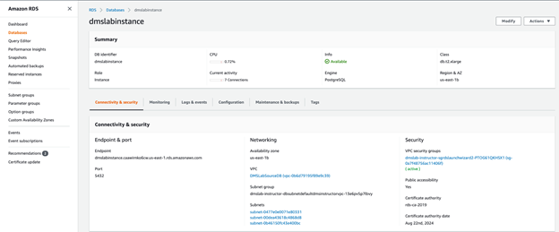

2.	Security group associated with RDS instance will be automatically selected. Select Inbound Rules and Click Edit Rules.

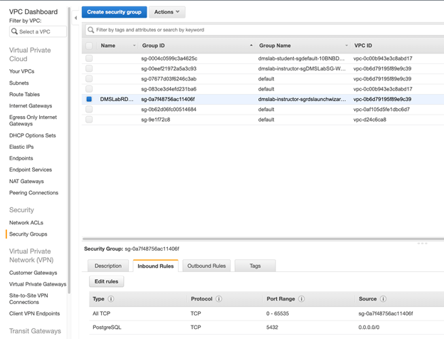

3.	Create Inbound Rules as shown below:
a.	All TCP with self-reference of security group as its own source.
b.	PostgreSQL on 5432 from 0.0.0.0/0
c.	Click on Save Rules

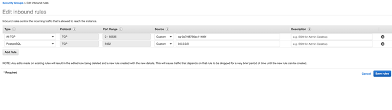

4.	Create S3 VPC endpoint. Navigate to VPC Dashboard and select Endpoint from left section. Click on “Create Endpoint”.

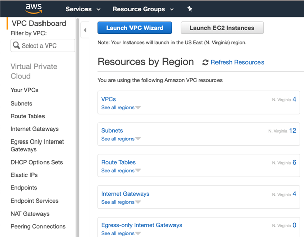

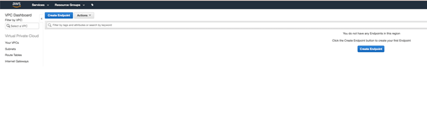

5.	In the next window, follow these steps:
a.	Service Category: AWS Services
b.	Service name: com.amazonaws.us-east-1.s3
c.	VPC: same as VPC for RDS instance
d.	Route table: in accordance to subnets
e.	Policy: Full Access
f.	Click on Create Endpoint

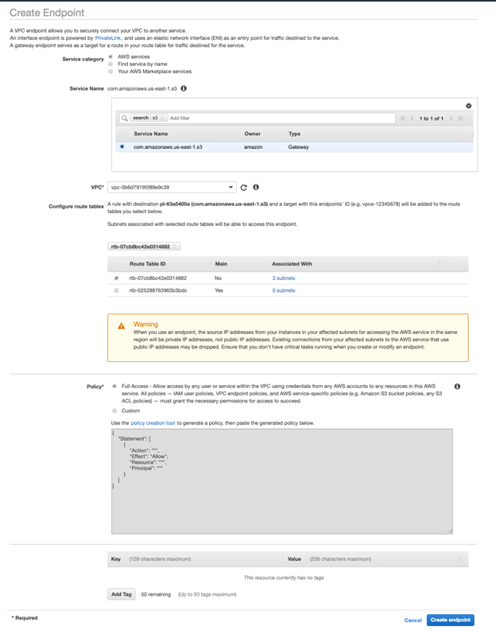

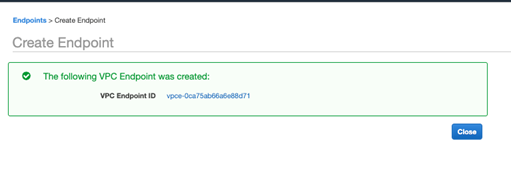

Endpoint creation is successful.
Create an IAM role to use with Lake Formation:
Documentation Reference: Link
Create the IAM Role by following below steps:

1.	On the IAM console, In the navigation pane, choose Roles, and then choose Create role.

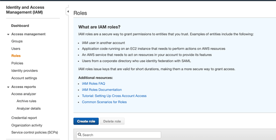

2.	On the Create role page, choose AWS service, and choose Glue. Then choose Next:Permissions. 
6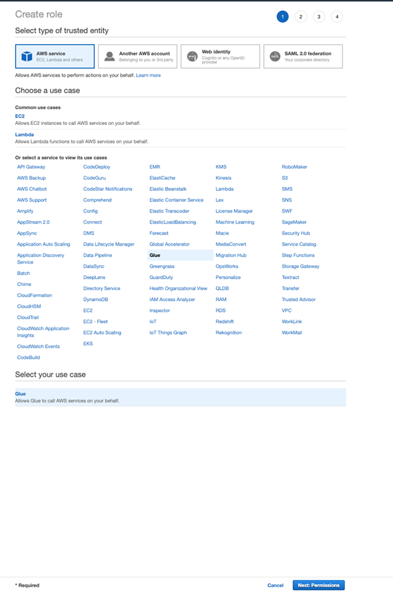
3.	Search for and select the AWSGlueServiceRole managed policy. Optionally, provide tags. 

4.	Then complete the wizard, naming the role LakeFormationWorkflowRole, and choose Create role.
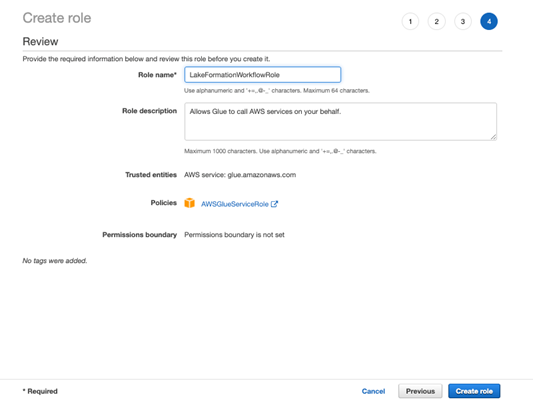
5.	Back on the Roles page, search for and choose LakeFormationWorkflowRole.
6.	On the role Summary page, under the Permissions tab, choose Add inline policy, and add the following policy in JSON editor. 
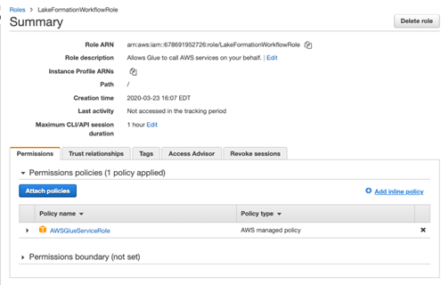

{
    "Version": "2012-10-17",
    "Statement": [
        {
            "Sid": "Lakeformation",
            "Effect": "Allow",
            "Action": [
                 "lakeformation:GetDataAccess",
                 "lakeformation:GrantPermissions"
             ],
            "Resource": "*"
        }
    ]
}

7.	Name the policy DatalakeDataAccess and click on Create Policy
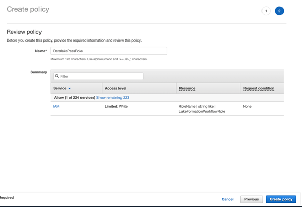
8.	Add another inline policy that allows the role to pass itself by granting the PassRole permission. Name the policy DatalakePassRole.
Important: In the following policy, replace account-id with your AWS account number. Account ID can be found in Account Summary page.
{
    "Version": "2012-10-17",
    "Statement": [
        {
            "Sid": "PassRolePermissions",
            "Effect": "Allow",
            "Action": ["iam:PassRole"],
            "Resource": [
                "arn:aws:iam::account-id:role/LakeFormationWorkflowRole"
            ]
        }
    ]
}
9.	Back to policy page, add two more AWS service level permissions: AmazonS3FullAccess and AWSGlueConsoleFullAccess
10.	On the Summary page, verify that there are five policies attached to the role.
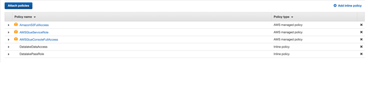
Create Glue JDBC connection for RDS 

1.	On the AWS Glue menu, select Connections.

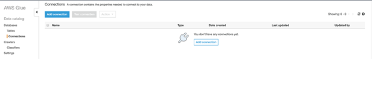

2.	Click Add Connection. 
3.	Enter the connection name. This name should be descriptive and easily recognized (e.g ," glue-rds-connection").
4.	Choose RDS for connection type and PostgreSQL for Database Engine 
5.	Optionally, enter the description. This should also be descriptive and easily recognized and Click Next.

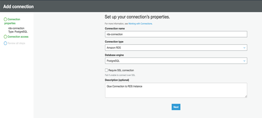

6.	Choose RDSInstance Name as Instance and enter password – created in the first step and Click Next and Click Finish.
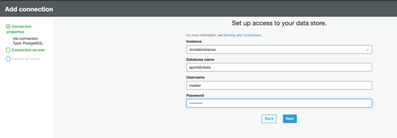
7.	glue-rds-connection was created successfully. To test it, select the connection, and choose Test connection. 
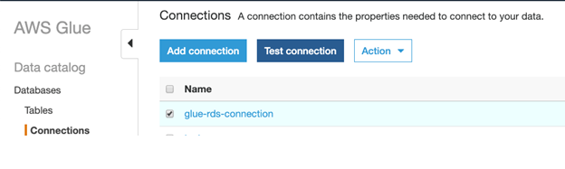
8.	To Test connection, choose the IAM role created in the previous step and then click on Test Connection.
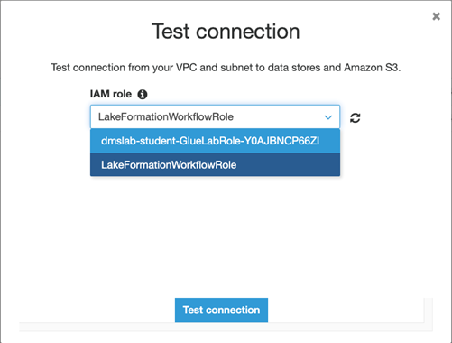
Lake Formation – Add Administrator and start workflows using Blueprints. 
Navigate to the AWS Lake Formation service.
1.	If you are logging into the lake formation console for the first time then you must add administrators first in order to do that follow Steps 2 and 3. Else skip to Step 4.
2.	Click Add administrators
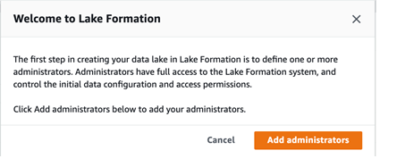
3.	Add your <login user> as the Lake Formation Administrator and Click Save
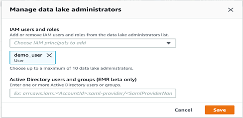
4.	Navigate to Databases on left pane. Select Glue Database and click on “Actions”, select “Grant” to grant permissions. 

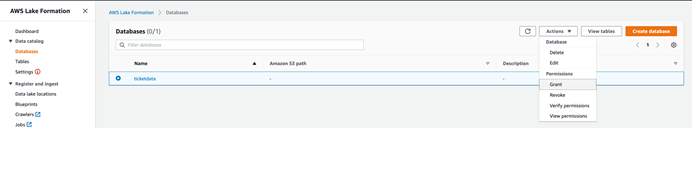

5.	Under “IAM Users and Roles”, select Lake Formation role that you created – “LakeFormationWorkflowRole” and for user, select your username. Grant “super” permissions for Database permissions and Grantable permissions.
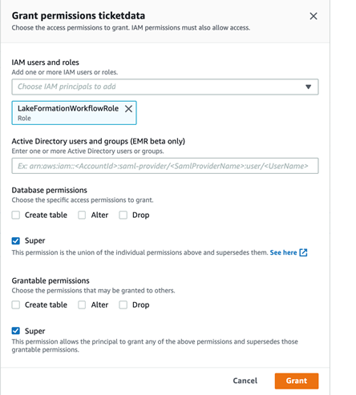

6.	On the left pane navigate to Blueprints click Use blueprints.
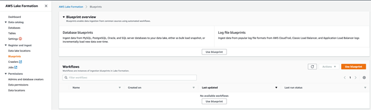
a.	For Blueprint Type, select Database snapshot
b.	Under Import Source
i.	For Database Connection choose the DB connection created in the glue. [Ex: “glue-rds-connection”]
ii.	For Source Data Path enter RDS database in database/schema/table format.
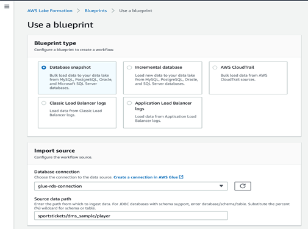

c.	Under Import Target
i.	For Target Database, choose existing Glue database created earlier.
ii.	For Target storage location choose the S3 bucket - For Bucket name, type the name of the s3 bucket that you created earlier in student lab. 
iii.	Add a folder at the end of the bucket url path.
NOTE: The value is similar to the following string, <StackName>-s3bucketname
iv.	For Data Format choose Parquet

d.	For Import Frequency, Select Run On Demand
e.	For Import Options;
i.	Give a suitable Workflow Name
ii.	For the IAM role choose the LakeFormationWorkflowRole created previously
iii.	For Table prefix type “lakeformation_”
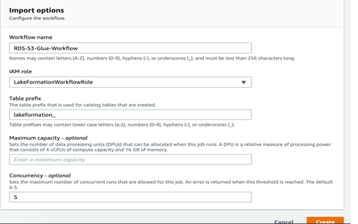
7.	Leave other options as default, Choose Create, and wait for the console to report that the workflow was successfully created. 
8.	Once the blueprint gets created, click on Start it Now? 
[There may be a delay of 5-10s delay in the blueprint showing up. You may have to hit refresh. Select the blueprint and choose Start in Actions drop down]
9.	Once the workflow starts executing, you will see the status changes from running  discovering  
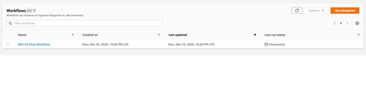
Explore the Underlying Components of a Blueprint
 
The Lake Formation blueprint creates a Glue Workflow under the hood which contains Glue ETL jobs – both python shell and pyspark; Glue crawlers and triggers. It will take somewhere between 15-20 mins to finish execution. In the meantime, let us drill down to see what it creates for us;

1.	On the Lake Formation console, in the navigation pane, choose Blueprints
2.	In the Workflow section, click on the Workflow name. This will direct you to the Workflow run page. Click on the Run Id. 
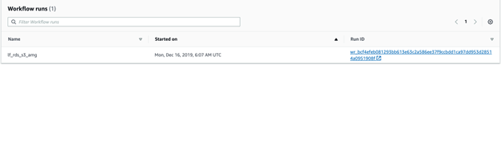

3.	On the Glue Console page, click on Get Started and head to ETL Workflows in the navigation pane.
4.	Here you can see the graphical representation of the Glue workflow built by Lake Formation blueprint. Highlighting and clicking on individual components will display the details of those components (name, description, job run id, start time, execution time)
5.	To understand what all Glue Jobs got created as a part of this workflow, in the navigation pane, click on Jobs.
10.	Every job comes with history, details, script and metrics tab. Review each of these tabs for any of the python shell or pyspark jobs.

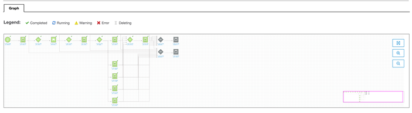
Explore workflow results in Athena
1.	Navigate to the Glue console
2.	Navigate to Databases on the left panel and select Target Database created in LakeFormation Console.
3.	Click on “Tables in Database” and this table will be pre fixed by “lakeformation_”
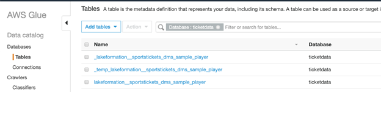
4.	And Click Action -> View Data
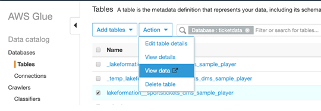
5.	This will now take you to Athena console, where you can preview the table contents, as show below;
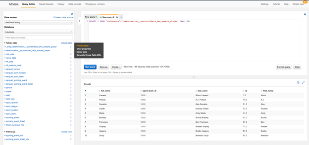
Grant fine grain access controls to Data Lake user

Before we start the querying the data, let us create an IAM User datalake_user and grant column level access on the table created by the Lake formation workflow above, to datalake_user. 
1.	Login as admin user to your account. Navigate to IAM Console and click on Add User. 
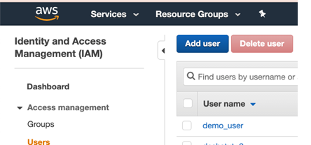
2.	Create a user named datalake_user and give it a password: master123. 
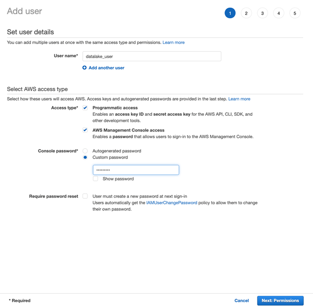

3.	Next click on Permissions and keep navigating to the next steps until reached the end. Review the details and click on “Create User”.

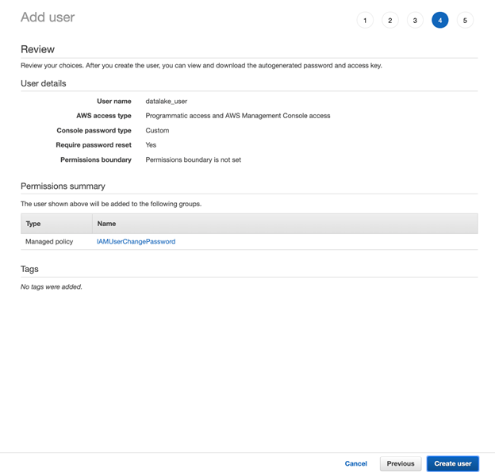

4.	Navigate to the Lake Formation console, in the navigation pane, under Permissions, choose Data permissions.

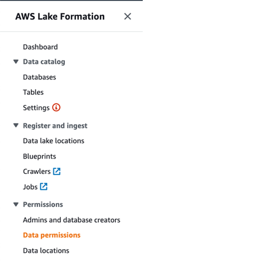
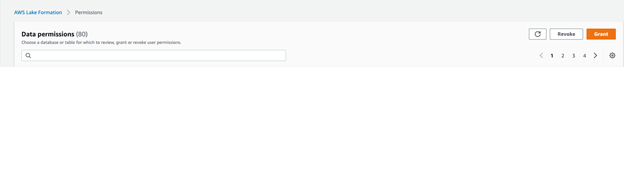

5.	Choose Grant, and in the Grant permissions dialog box, do the following: 
a.	For IAM user and roles, choose datalake_user. 
b.	For Database, choose ticketdata
c.	The Table list populates. 
d.	For Table, choose the table shown. 
e.	For Columns, select Include Columns and choose col1,col2 first two columns
f.	For Table permissions, choose Select. 
6.	Choose Grant. 

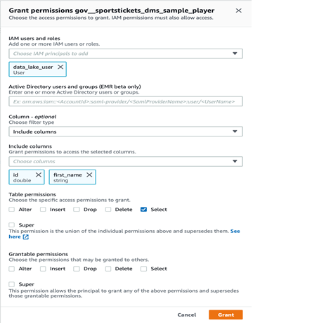
Verify data permissions using Athena
Using Athena, let us now explore the data set as the datalake_user. 
1.	Sign in to AWS account with account ID and username as the datalake_user user – datalake_user (username: datalake_user)
2.	Navigate to Amazon Athena console. 
3.	Before you run your first Athena query, you need to set up a query result location in Amazon S3. On the right side of the Athena console, click on Settings and type in the S3 bucket location. The entry should look something like this: s3:// athenaqueryresults-<Accountnumber>/ 
4.	Next, ensure GLUE database is selected. 
5.	Now run a Select query on the table within the database. There should be only one table in there, which was created by Lake Formation workflow.
6.	You will see that the datalake_user can only see the columns first two columns in the select query result. The datalake_user cannot see any other columns in the table. This is because, datalake_admin gave datalake_user permissions to only select from table for the first two columns. 

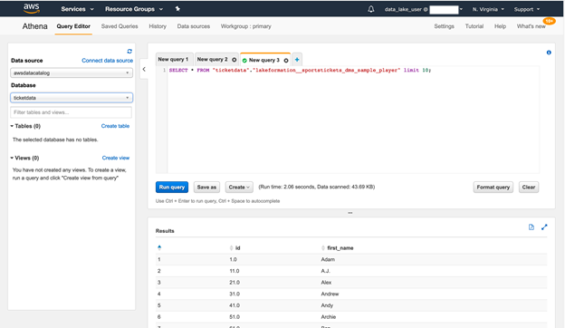

Viewing data in QUICKSIGHT
Open Quicksight in AWS console
Click on NewAnalysis on QuickSight
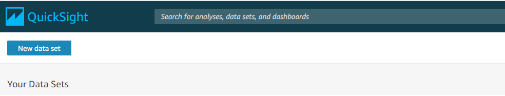
Click on NewDataSet and on Athena
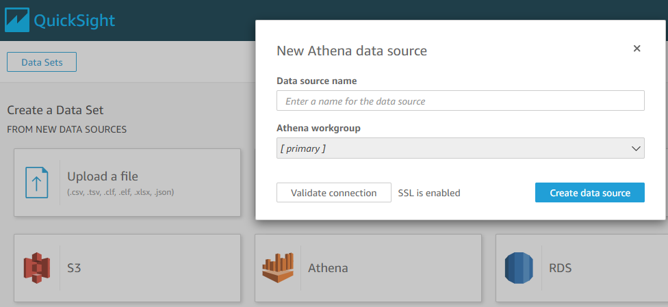
On this enter Data Source  Name and click on Create Data Source
Then select the Database and table 
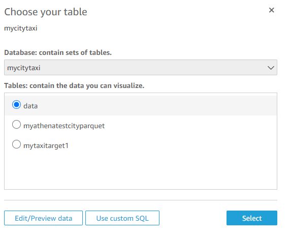
You can load data into spice or select direct query option and click on Visualize
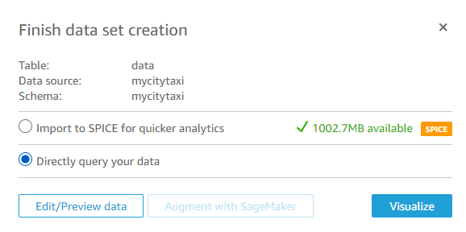
Final data after selecting chart and data
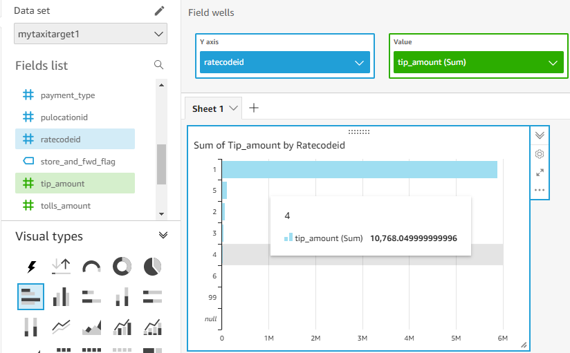

## Security

See [CONTRIBUTING](CONTRIBUTING.md#security-issue-notifications) for more information.

## License Summary

The documentation is made available under the Creative Commons Attribution-ShareAlike 4.0 International License. See the LICENSE file.

The sample code within this documentation is made available under the MIT-0 license. See the LICENSE-SAMPLECODE file.
